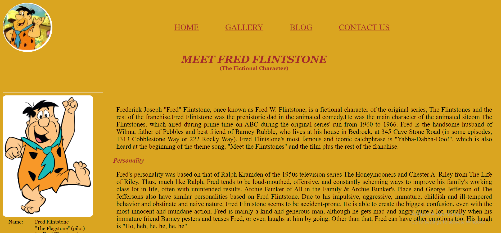

## Fred Flintston - Fictional Character

The project is all about Fred Flintston which is a fictional Character. It includes home page with all the information of Fred Flinstone, a gallery page populated with Fred's photos and his family , a blog page with two or three famous blogs and a contact page.

## Motivation

The First sprint project done after completing one month @Masai School.

## Tech/framework

[][webdevplaylist]
[][cssplaylist]

## Screenshots

## Installation

> - Clone the repo
>   `git clone https://github.com/Tripathikritika/masai-sprint-1.git`

## Credits

`https://masaischool.com/`

[cssplaylist]: #
[webdevplaylist]: #
